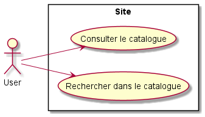
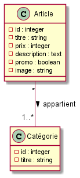

#Documentation
##Présentation du projet
Le projet consiste à créer un catalogue à partir de plusieurs articles, 
un système de recherche d'article y est intégré.

##Analyse
####Diagramme de user stories 

- Liste des users des stories

------
####Diagramme de classes

- Liste des classes

##Outils utilisés
- PHP : version 7.4
- Symfony : version 4.1
- Bundles :
    - [Faker](https://github.com/fzaninotto/Faker)
- IDE : PhpStorm
- BDD : MySQL
- [Bootstarp](https://getbootstrap.com/)

